## Esse documento especifica as funcionalidades e ferramentas desenvolvidas nessa aplicação

  

# Telas desenvolvidas:

- [Login](#login)
- [Cadastro](#cadastro)
- [Menu](#menu-lateral)
- [Pesquisa](#pesquisa)
- [Colaboradores](#colaboradores)
- [Painel](#painel)
- [Desenvolvimento](#desenvolvimento)
- [Telas em construção](#telas-em-construção)

  

## Login

### A tela de login faz a conexão com o servidor backend com uma requisição `POST`, passando o `email` e `senha` do usuário. Se o usuário constar no banco de dados e tiver o atributo `cargo` igual a `Gerente`, o login é autorizado. Caso contrário, uma mensagem de erro é exibida informando que somente o gerente pode logar na plataforma. Se o login for aprovado, o backend retorna um token JWT, que é salvo nos cookies do navegador e permite que o usuário tenha acesso às demais páginas.

### Antes da requisição para o backend, o frontend trata as entradas com a finalidade de trazer mais segurança contra ataques de Code Injection e evitar requisições desnecessárias.

### Nesse contexto, é validado se todos os campos estão preenchidos, se o email é válido, se a senha contém no mínimo 8 caracteres, pelo menos uma letra maiúscula, uma minúscula, um numeral e um caractere especial. Caso alguma dessas pendências não seja verdadeira, é retornada uma mensagem de alerta.

### Quando o usuário tem o seu login aprovado, ele é automaticamente redirecionado para a tela principal.

    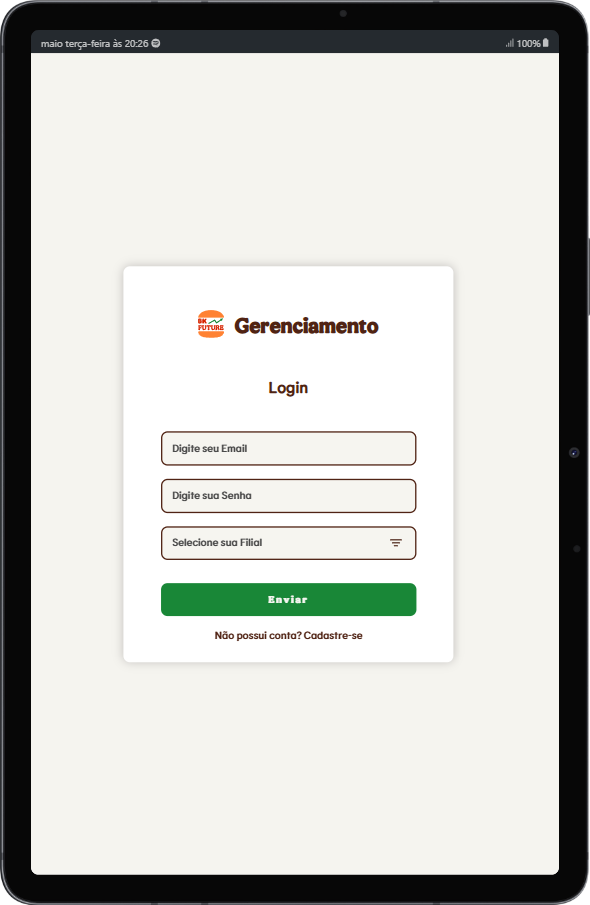
    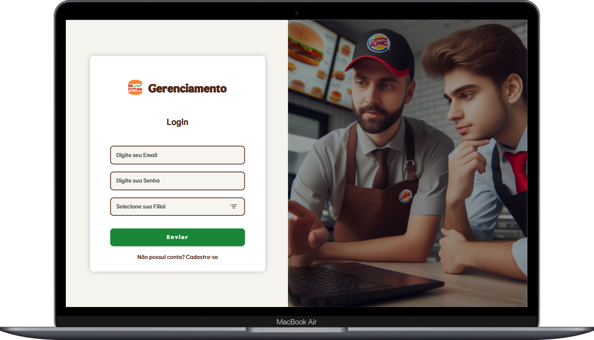
    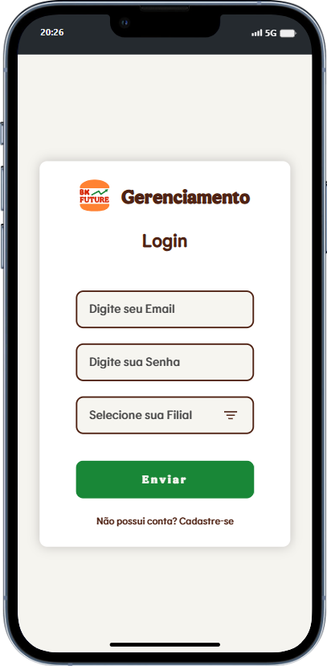

 

## Cadastro

### A tela de cadastro faz a conexão com o servidor backend com uma requisição `POST`, passando o `nome`, `email`, `CPF`, `senha` e `filial` do usuário. Essa funcionalidade foi pensada para que o gerente possa cadastrar novos colaboradores. Porém, para fins de teste, essa funcionalidade cadastra os dados de entrada com o cargo de gerente.

### Antes da requisição para o backend, o frontend trata as entradas com a finalidade de trazer mais segurança contra ataques de Code Injection e evitar requisições desnecessárias.

### Nesse contexto, é validado se todos os campos estão preenchidos, se o email é válido, se a senha contém no mínimo 8 caracteres, pelo menos uma letra maiúscula, uma minúscula, um numeral e um caractere especial, além de validar se já existe um usuário cadastrado com essas informações. Caso alguma dessas pendências não seja verdadeira, é retornada uma mensagem de alerta.

### Quando o usuário tem o seu cadastro aprovado, ele é automaticamente redirecionado para a tela de login, onde pode validar os seus dados e entrar na aplicação.

 

## Menu Lateral

### O menu lateral é uma área que permite que o usuário navegue entre as telas de colaboradores, painel, criar formulário, criar evento e central.

 

## Pesquisa

### A barra superior de pesquisa permite que o usuário filtre todos os colaboradores, tanto pesquisando por nome, cargo ou turno, ou utilizando uma lista preselecionada para filtrar por cargos de gerência ou operacional, turno manhã ou noite, e ordenar os colaboradores em ordem alfabética, tanto crescente quanto decrescente.

 

## Colaboradores

### A tela de colaboradores consiste na junção de três áreas: o menu lateral, a área de pesquisa e a área de colaboradores, onde estão listados todos os colaboradores daquela filial com o seu nome, cargo e turno.

### Ao clicar no botão "`+`", é aberto um modal pop-up com mais informações sobre o colaborador em questão, como suas habilidades, sonhos, metas, etc.

    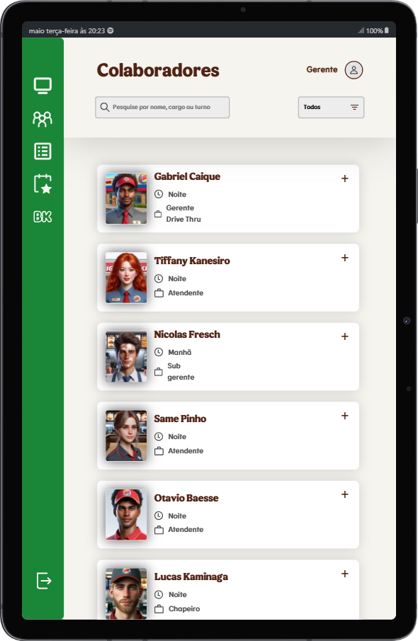
    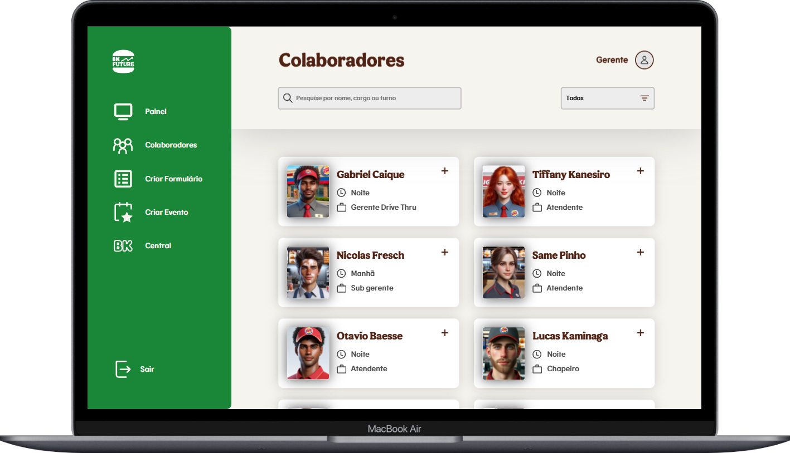
    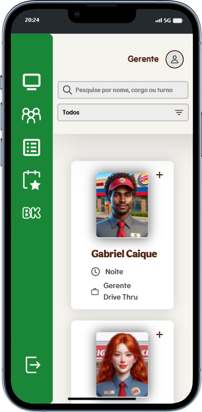

    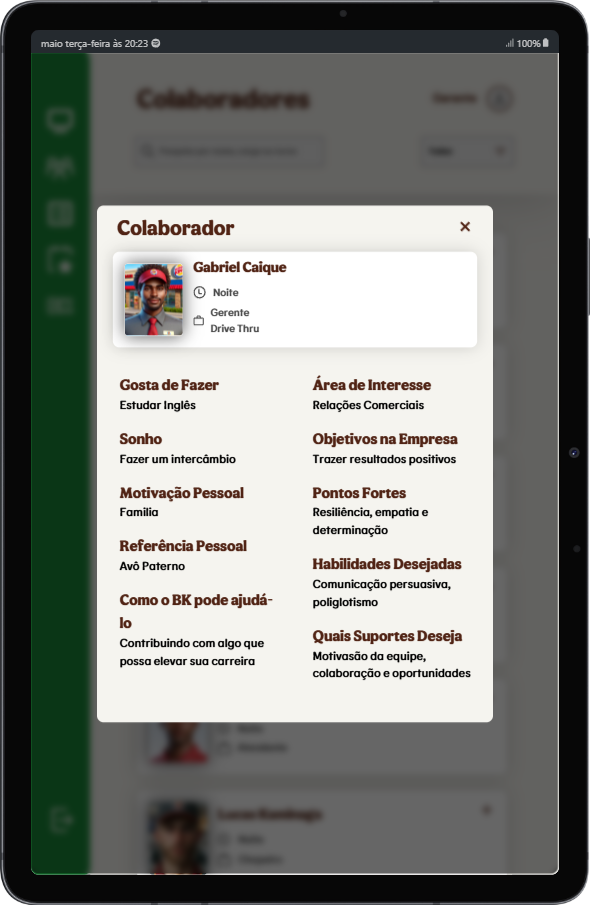
    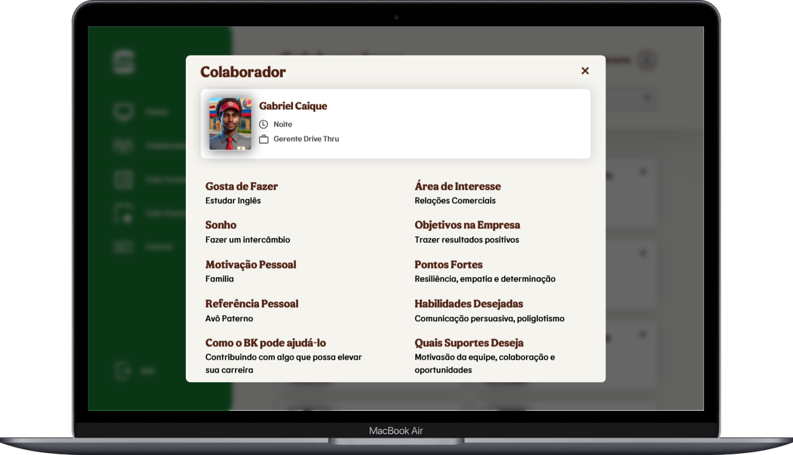
    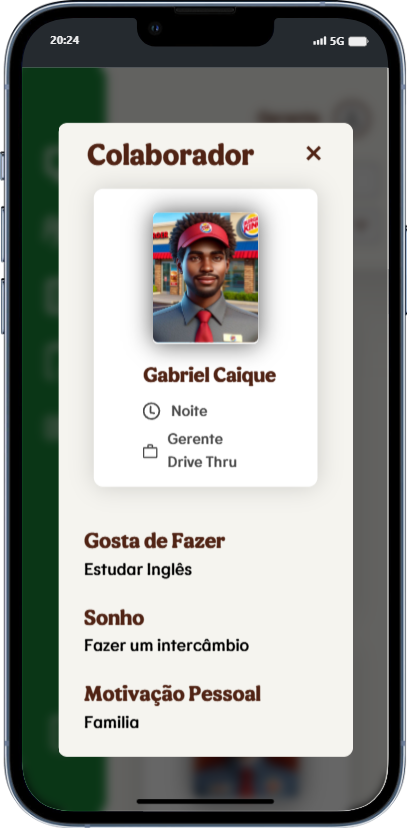

 

## Painel

### A tela de painel, assim como a tela de colaboradores, é composta por três áreas: o menu lateral, a área de pesquisa e a área de dashboards. Essa área é subdividida em outras três partes. A primeira é uma lista de todos os funcionários e o seu progresso na realização das atividades semanais, exibido no formato de uma barra de progresso que muda de amarelo para verde dependendo da porcentagem de preenchimento. A segunda área é um gráfico em formato de pizza, que calcula a média das tarefas realizadas pela equipe e apresenta a porcentagem de colaboradores abaixo da média, na média e acima da média, possibilitando um melhor feedback do time. Por fim, a terceira área é um ranking com os cinco colaboradores com o maior número de conquistas, incluindo também o intervalo de tempo em que essas conquistas foram ganhas.

    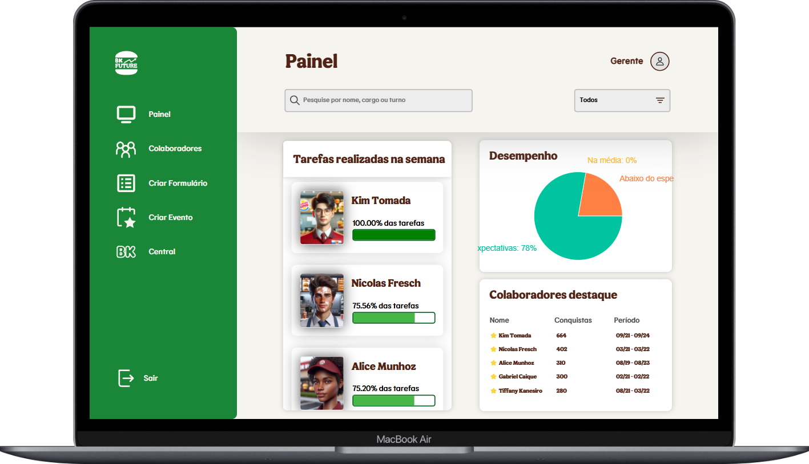

 

## Desenvolvimento

### A tela de desenvolvimento é uma tela padrão que é exibida caso o usuário tente acessar alguma página que ainda está em desenvolvimento.

    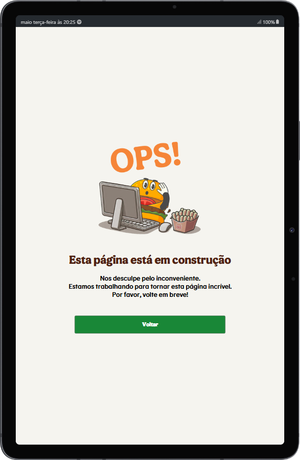
    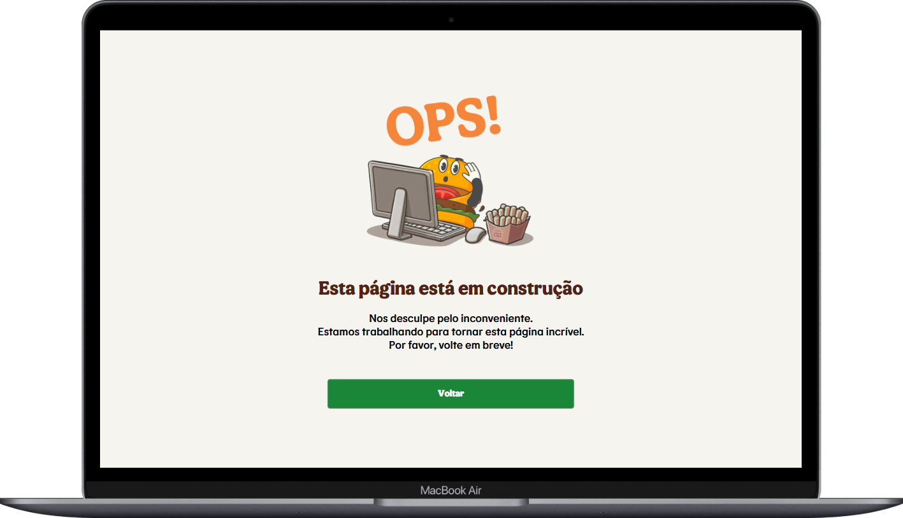
    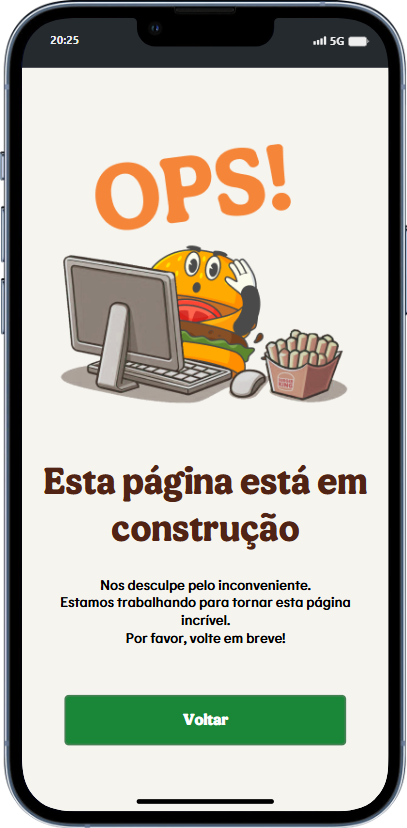

 

## Telas em construção

### As telas "Criar Formulário", "Criar Evento" e "Central" ainda não foram implementadas. Logo, ao tentar acessá-las, o usuário é redirecionado para a tela de desenvolvimento.

   

# Bibliotecas Utilizadas

- **@testing-library/react@15.0.7**: Uma biblioteca para escrever testes de componentes React focados no comportamento do usuário.
- **@types/react-dom@18.3.0**: Tipagens TypeScript para a biblioteca ReactDOM, que é usada para manipular a árvore de elementos do DOM.
- **@types/react@18.3.2**: Tipagens TypeScript para a biblioteca React, que é uma biblioteca JavaScript para criar interfaces de usuário.
- **@vitejs/plugin-react@4.2.1**: Um plugin Vite para permitir a compilação de arquivos React.
- **chroma-js@2.4.2**: Uma biblioteca JavaScript para manipulação de cores.
- **eslint-plugin-react-hooks@4.6.2**: Um plugin ESLint que fornece regras adicionais para os Hooks do React.
- **eslint-plugin-react-refresh@0.4.7**: Um plugin ESLint que fornece regras para suportar a atualização de componentes do React.
- **eslint-plugin-react@7.34.1**: Um plugin ESLint que fornece regras específicas do React para o ESLint.
- **eslint@8.57.0**: Uma ferramenta de linting para JavaScript e TypeScript.
- **jest@29.7.0**: Um framework de teste de JavaScript com foco na simplicidade.
- **js-cookie@3.0.5**: Uma biblioteca JavaScript para manipulação de cookies.
- **react-dom@18.3.1**: Uma biblioteca JavaScript para renderizar componentes React no navegador.
- **react-router-dom@6.23.1**: Uma extensão da biblioteca React Router para construir aplicativos de navegador de uma única página com React.
- **react-toastify@10.0.5**: Uma biblioteca para exibir notificações de toast em aplicativos React.

